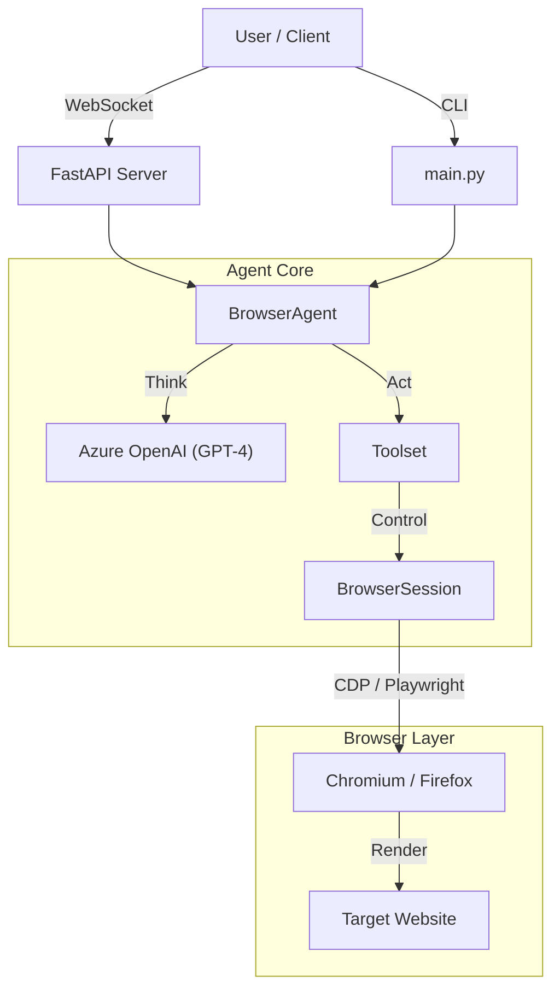

# 🕷️ BrowserAgent

> **The Next-Gen AI Web Scraper & Automation Agent.**
> *Powered by Playwright, LangChain, and Azure OpenAI.*


**BrowserAgent** is a high-performance, agentic web scraping framework designed to navigate the modern web like a human but at machine speed. It uses LLMs (GPT-4) to understand DOM structures, plan actions, and extract structured data from any website—even those with complex dynamic content or anti-bot protections.

---

## 🚀 Key Features

*   **🧠 Agentic Intelligence**: Powered by GPT-4, it "sees" the page, plans navigation, and adapts to changes automatically.
*   **⚡ High Performance**:
    *   **Headless Mode**: Runs without UI for maximum speed.
    *   **Resource Blocking**: Automatically blocks ads, trackers, images, and fonts to save bandwidth.
    *   **Optimized Navigation**: Smart waiting strategies (`domcontentloaded`) for faster execution.
*   **🛡️ Anti-Detection**: Built-in stealth techniques to bypass bot detection systems.
*   **👁️ Vision Support**: Uses multimodal LLMs to understand page layout via screenshots.
*   **🌐 Multi-Engine**: Support for **Chromium**, **Firefox**, and **WebKit**.
*   **🔌 API First**: Includes a **FastAPI WebSocket Server** for real-time integration.
*   **💾 Persistence**: Maintains session state (cookies, local storage) across runs.

---

## 🛠️ Installation

1.  **Clone the repository**:
    ```bash
    git clone https://github.com/gourabsen21s/agentic-product-scraper.git
    cd browser-agent
    ```

2.  **Create a virtual environment**:
    ```bash
    python -m venv .venv
    source .venv/bin/activate  # On Windows: .venv\Scripts\activate
    ```

3.  **Install dependencies**:
    ```bash
    pip install -r requirements.txt
    playwright install
    ```

4.  **Configure Environment**:
    Create a `.env` file in the root directory:
    ```env
    AZURE_OPENAI_API_KEY=your_key_here
    AZURE_OPENAI_ENDPOINT=your_endpoint_here
    AZURE_OPENAI_API_VERSION=2024-12-01-preview
    AZURE_OPENAI_DEPLOYMENT_NAME=gpt-4
    ```

---

## 💻 Usage

### 1. CLI Mode (Direct Execution)
Run the agent directly to perform a predefined task in `main.py`.

```bash
python main.py
```

### 2. Server Mode (WebSocket API)
Start the FastAPI server to accept tasks remotely.

```bash
uvicorn server:app --port 8000
```

**Connect & Send Task:**
Connect to `ws://localhost:8000/ws` and send a JSON payload:

```json
{
    "task": "Navigate to https://example.com, search for 'AI Agents', and return the top 3 results."
}
```

**Response:**
```json
{
    "status": "success",
    "result": {
        "data": [
            {"title": "Result 1", "url": "..."},
            {"title": "Result 2", "url": "..."}
        ]
    }
}
```

---

## 🏗️ Architecture



---

## ⚙️ Configuration

Customize the agent via `src/browser/profile.py`:

| Parameter | Default | Description |
| :--- | :--- | :--- |
| `headless` | `True` | Run without visible UI. |
| `browser_type` | `chromium` | Engine to use (`chromium`, `firefox`, `webkit`). |
| `block_resources` | `True` | Block images/fonts for speed. |
| `wait_until` | `domcontentloaded` | Navigation wait strategy. |
| `user_data_dir` | `./browser_data` | Directory for persistent sessions. |

---

## 🤝 Contributing

Contributions are welcome! Please feel free to submit a Pull Request.

1.  Fork the Project
2.  Create your Feature Branch (`git checkout -b feature/AmazingFeature`)
3.  Commit your Changes (`git commit -m 'Add some AmazingFeature'`)
4.  Push to the Branch (`git push origin feature/AmazingFeature`)
5.  Open a Pull Request

---

## 📄 License

Distributed under the MIT License. See `LICENSE` for more information.
